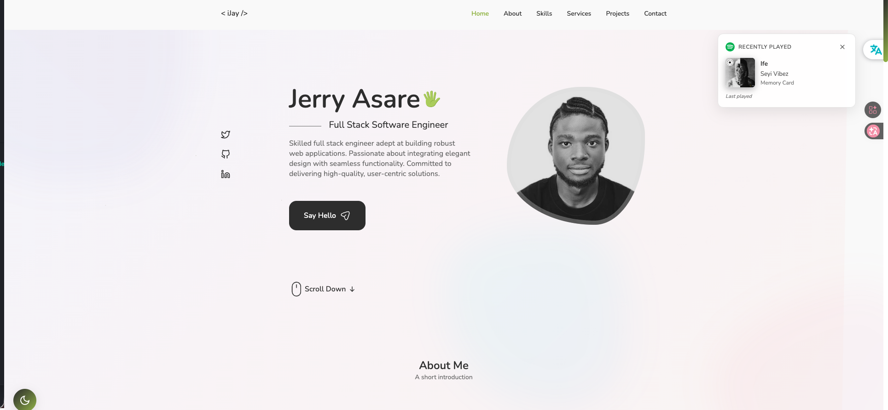

# Portfolio Project



A responsive portfolio site built with Next.js and vanilla CSS, featuring Swiper for sliding components and EmailJS for contact services.

## Tech Stack

- Next.js 16
- React 19
- Swiper
- EmailJS
- Framer Motion

## Features

- Responsive Layout
- Dark/Light Theme Toggle
- Fixed Navigation
- Pop-up Modals
- Tab Panels
- Slider + Pagination
- Contact Form with Status Feedback
- Scroll to Top

## Getting Started

```bash
# Install dependencies
npm install

# Run development server
npm run dev

# Build for production
npm run build

# Start production server
npm run start
```

## Environment Variables

Create a `.env.local` file in the project root:

```
NEXT_PUBLIC_EMAILJS_SERVICE_ID=your_service_id
NEXT_PUBLIC_EMAILJS_TEMPLATE_ID=your_template_id
NEXT_PUBLIC_EMAILJS_PUBLIC_KEY=your_public_key
```

Get these values from your [EmailJS Dashboard](https://dashboard.emailjs.com/admin).

## Dependencies

### React Icons

```bash
npm install react-icons
```

Icons from the _Feather_ and _Heroicon_ sections of [React-Icons](https://react-icons.github.io/react-icons/).

### Swiper

```bash
npm install swiper
```

Slider component from [SwiperJS](https://swiperjs.com/react) with pagination module.


### EmailJS

```bash
npm install @emailjs/browser
```

Contact form powered by [EmailJS](https://www.emailjs.com/docs/examples/reactjs/).


