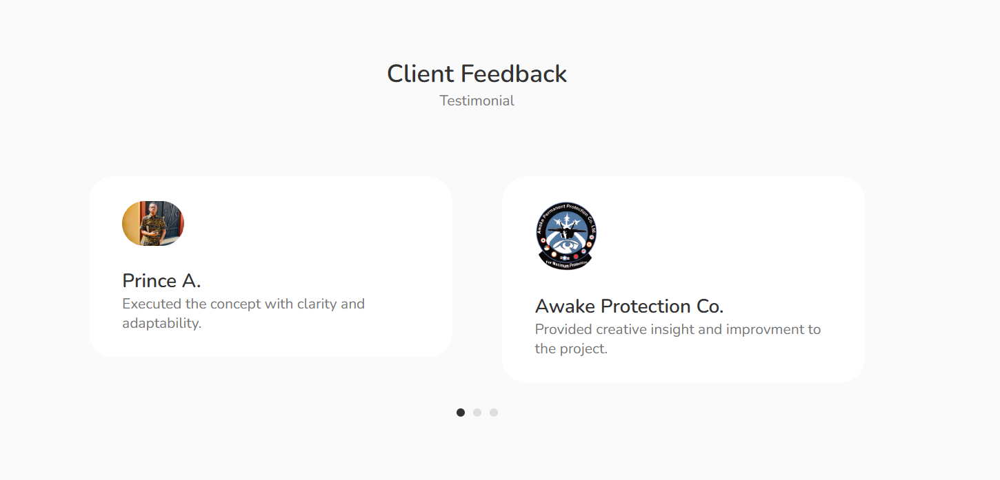
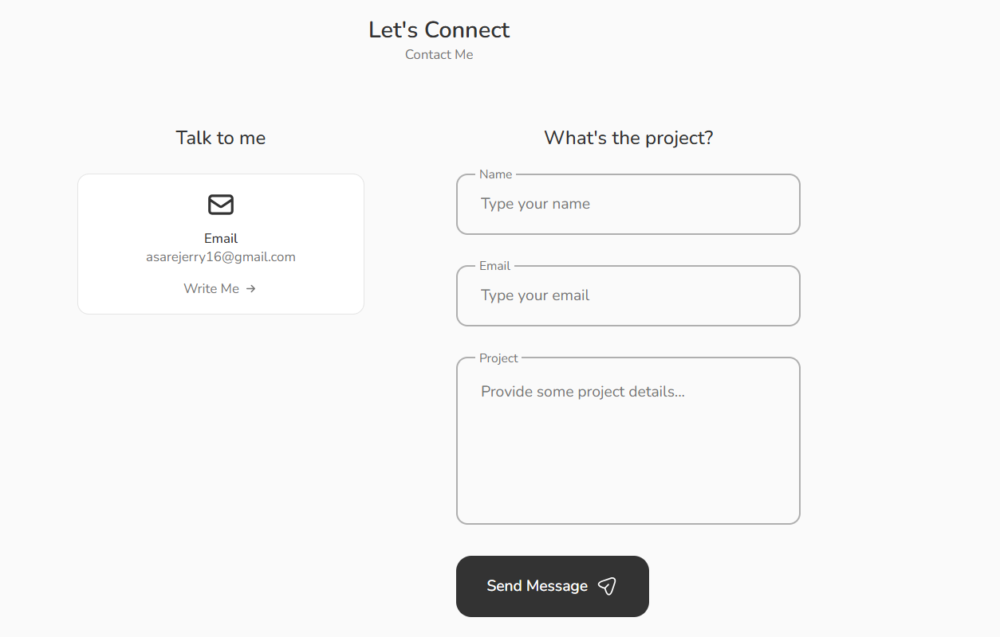

# Portfolio Project

This is a responsive portfolio site created with React and vanilla CSS that implements Swiper for sliding components and EmailJS for contact services.

### Project Features:

- Responsive Layout
- Fixed Navigation
- Pop-up Modals
- Tab Panels
- Slider + Pagination
- Contact Form
- Scroll to Top

## React-Icons

`npm install react-icons --save`

The icons from this project can be found in the _Feather_ or _Heroicon_ sections of the [React-Icons](https://react-icons.github.io/react-icons/) library.

## Slider Component

`npm i swiper`

The slider component of the testimonial section is imported from [SwiperJS](https://swiperjs.com/react) and also utilizes their pagination module.

## Email Component

`npm install @emailjs/browser --save`

The form modal of the contact section is setup using SDK and an email template from [EmailJS](https://www.emailjs.com/docs/examples/reactjs/).

